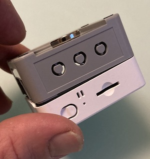

# Build your own portable, graphing CO₂ sensor

## Motivation

CO₂ levels measured indoors can be used as an indicator of air quality.

Outdoor air has a CO₂ ppm level of 400 ppm. Humans exhale air with 40000 ppm. You can calculate the percentage of exhaust air you are breathing by dividing measured CO₂ level above outdoor by the human exhaust level. Used air might contain aerosols which might contain the corona virus.

High indoor CO2 levels also have an impact on the cognitive performance of humans. 

Smoca AG decided to build this easy to reproduce CO₂ measuring device to help slow the spread of the corona virus in offices.
It supports its users in deciding when ventilating the room begin monitored is advisable. It also raises awareness for the correlation between CO₂ level and air quality.

## Hardware

The following hardware is needed:

| description | cost |  link |
|-|-|-|
| Sensirion SCD30 | 54 USD | https://www.digikey.com/en/products/detail/sensirion-ag/SCD30/8445334 |
| M5 Stack Core2 | 39.9 USD | https://www.digikey.com/en/products/detail/m5stack-technology-co-ltd/K010/13151126?s=N4IgTCBcDaILYFYDOAXAhgYwNYAIMHsAnAUwgF0BfIA
| M5 Stack Proto Board | 2.95 USD | https://www.digikey.com/en/products/detail/m5stack-technology-co-ltd/M001/10492145
| M5 Stack PLC Base | 9.95 USD |  https://m5stack.com/collections/m5-base/products/plc-proto-industrial-board-module
| M5 Stack Battery (optional) | 7.95 USD | https://www.digikey.com/en/products/detail/m5stack-technology-co-ltd/M002/10492127

Note: The optional battery increases the battery operation time from 6 to 10 hours.

### Building

1. Power the Core2 module. A factory test application should be loaded. Test the device.
2. Remove the bottom of the Core2 module. Keep the battery there or replace it with the optional bigger one. 

3. Remove the PCB from the proto module. 
4. Connect the SCD30 module to the proto module. We used headers. 

5. Screw the proto module to the PLC Base
6. Screw the PLC Base to the Core2 module 

7. HW Done, load the software

## Software

To initialise the device do the following:
1. Install Arduino studio
2. Install the latest version of the m5core2 library via GitHub https://github.com/m5stack/M5Core2
3. Install the esp32 board description https://github.com/espressif/arduino-esp32
4. Set the RTC of the device via ntp: adjust password.h to contain your wifi, run the set rtc sketch
5. Flash the m5stack-scd30 sketch

## Usage

**Disclaimer This is not a safety device. Always follow the local regulations regarding corona safety. No warranty is provided**

### Graphs

* The graphs alway show the last six hours. Every line on the graph represents the measurement of one minute. The last value measured in the given minute is used for the graph.
* To switch between different graphs (temperature / humidity / battery / co2) touch the corresponding value in the display

### microsd

If a microsd card formated with fat is present, a csv file, data.txt will be written every 2 seconds with the timestamp, the co2 level, the humidity, the temperature and the current battery charge.

### CO₂

| level | color | description |
|-|-|-|
| < 600 ppm | blue | outdoor air |
| 600 - 800 ppm | green | fresh indoor air |
| 800 - 1000 ppm | yellow | indoor air, ventilate the room if possible, small possibility of virus transmission |
| 1000 - 1400 ppm | orange | used indoor air, ventilate the room, cognition is impacted, possibility of virus transmission |
| > 1400 ppm | red | heavy used indoor air, heavy cognition impact, high possiblity of virus transmission, ventilation needed.

## Extended uses (no code provided)
* We use it at our office to control a couple of exhaust / inlet pwm computer fans to keep the CO₂ level below 800 ppm.
* We log the measurement results to a influxdb with a grafana dashboard. The grafana instance sends alerts to telegram for CO₂ levels above 800 ppm.

## Contact

If you have any suggestions for the project feel free to file an issue. If you want to build the device on a bigger scale / have any other development / prototyping needs, feel free to contact us: info@smoca.ch

## License

Copyright (c) 2020 David Gunzinger / smoca AG www.smoca.ch \
Code: GPL v3 \
Text / Graphics / Photographs: CC BY-SA